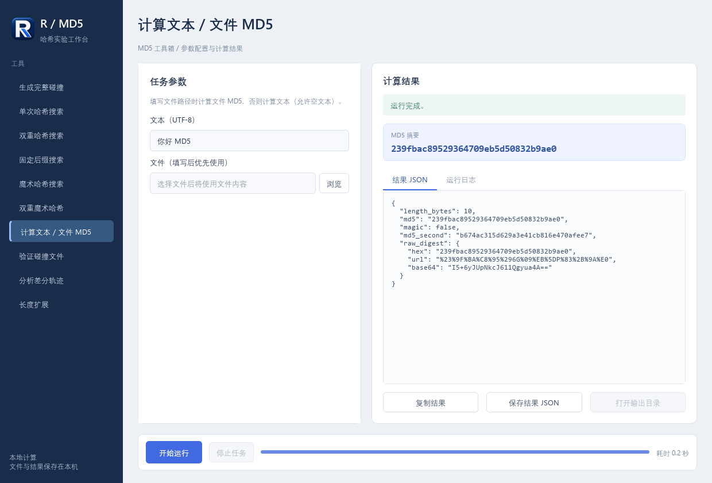

# R MD5 Toolkit

带 R 品牌标识的 Windows 桌面 MD5 工具箱，使用 Python + PySide6。
本仓库独立维护 UI 版本，计算核心来自同作者的
[MD5_Collision](https://github.com/fly12323/MD5_Collision)。



## 下载与运行

在 [Releases](https://github.com/fly12323/R-MD5-Toolkit/releases) 下载
`R-MD5-Toolkit-v1.0.0-windows-x64.zip`，解压整个目录，然后双击
`MD5Toolkit/MD5Toolkit.exe`。无需安装 Python；不能只复制 EXE。
目标平台为现代 Windows 10/11 x64；本次实测环境见 [验证说明](VALIDATION.md)。

生成完整碰撞需要另行安装本机 fastcoll，并在界面选择它的路径。
下载包和仓库均不捆绑 fastcoll，来源及限制见 [THIRD_PARTY.md](THIRD_PARTY.md)。

## 功能

- 完整 MD5 碰撞生成，以及二进制前缀支持。
- 单次、双重、固定后缀哈希搜索。
- 魔术哈希与双重魔术哈希搜索。
- 文本/文件摘要、碰撞验证和差分轨迹。
- MD5 长度扩展，支持文本与十六进制追加。
- 独立进程运行、停止任务、结果复制、JSON 保存和输出目录入口。

搜索有次数与时间上限；没有找到匹配会正常显示限额或超时状态。
这些功能面向 CTF 与密码学实验。MD5 不适合用于现代安全校验。

## 源码运行与打包

需要 Python 3.10+：

```powershell
python -m pip install -r requirements-ui.txt
python md5_desktop.py
python build_desktop.py
```

完整操作说明见 [DESKTOP.md](DESKTOP.md)，命令行核心说明见 [CLI_GUIDE.md](CLI_GUIDE.md)。
R 图标原图、多尺寸 ICO 和生成提示词保存在 [assets](assets/README.md)。

## 验证

```powershell
python -m unittest discover -s tests -v
python tests/desktop_smoke.py
python tests/desktop_full_check.py
python tests/desktop_frozen_smoke.py
```

桌面全流程检查需要已配置 `bin/fastcoll.exe`；EXE 检查需要先打包。
十种 UI 模式、38 项界面检查、26 项后端测试与最终 EXE 全模式检查已通过。
测试方法和实际覆盖边界见 [VALIDATION.md](VALIDATION.md)。
Python/Qt/PyInstaller 的第三方信息见 [THIRD_PARTY_UI.md](THIRD_PARTY_UI.md)。
